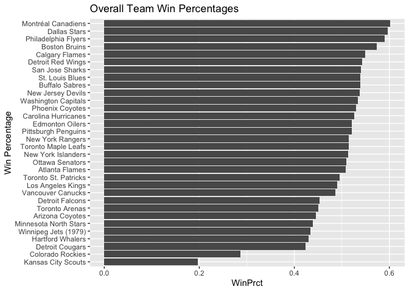
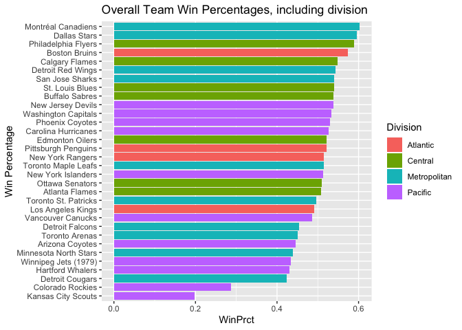
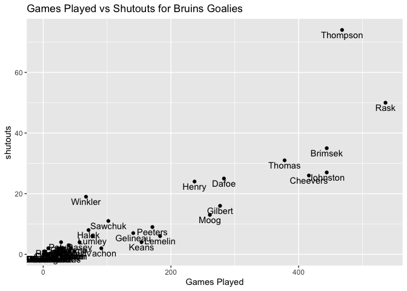
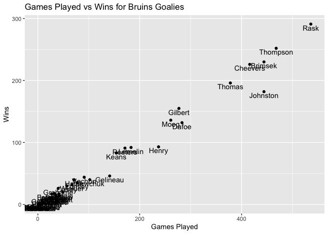
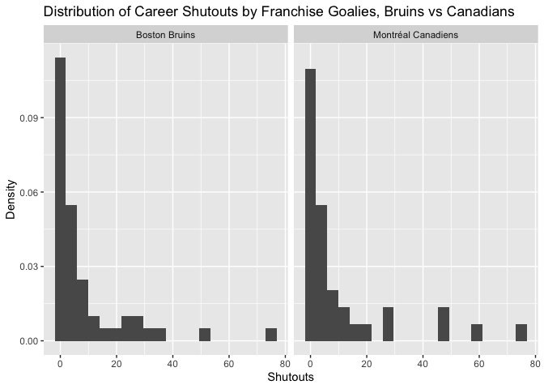
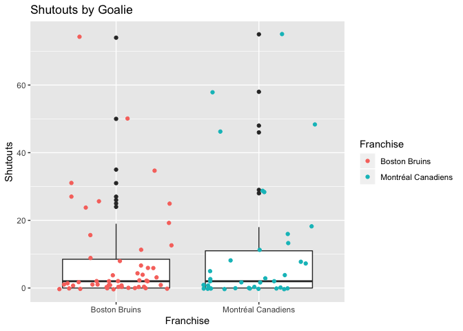

Guide for Using the NHL API
================
Matt Kasle
9/16/2020

## Required Packages

This vignette requires the Tidyverse, httr, and jsonlite packages.

## API Helper Functions

The NHL provides APIs to access an array of team and player statistics.
This vignette provides functions to help users access this data and
return well-formatted dataframes for various endpoints. The code below
creates a wrapper function for “one-stop-shop” access to a number of
endpoints in these APIs.

``` r
# Functions for Records API

recordsAPIHelper <- function(url){
  return(fromJSON(content(GET(url), "text"), flatten=TRUE)$data)
}

statsAPIHelper <- function(url, modifier){
  if(modifier == "team.roster"){
    data <- fromJSON(content(GET(url), "text"), flatten=TRUE)$teams
    for (i in 1:nrow(data)){
      if(i == 1){
        rosterData <- data[i, "roster.roster"]
      }
      else{
        rosterData <- bind_rows(rosterData, data[i, "roster.roster"])
      }
    }
    return(rosterData)
  }
  return(fromJSON(content(GET(url), "text"), flatten=TRUE)$teams)
}

getRecordsTbl <- function(url, team = NULL){
  if(length(team) > 0){
    if(!is.character(team)){
      return(recordsAPIHelper(paste0(url, "?cayenneExp=franchiseId=", team)))
    }
    else{
      teamId <- getFranchises() %>% filter(teamCommonName == team) %>% select(id)
      return(recordsAPIHelper(paste0(url, "?cayenneExp=franchiseId=", teamId[[1]])))
    }
  }
  return(recordsAPIHelper(url))
}

getStatsTbl <- function(modifier = NULL, team = NULL, season = NULL){
  url <- "https://statsapi.web.nhl.com/api/v1/teams"
  if(length(team) > 0){
    if(!is.character(team)){
      url <- paste0(url, "/", team)
    }
    else{
      teamId <- getFranchises() %>% filter(teamCommonName == team) %>% select(id)
      url <- paste0(url, "/", teamId)
    }
  }
  if(length(modifier) > 0){
    url <- paste0(url, "?expand=", modifier)
    if(length(season) > 0){
      url <- paste0(url, "&season=", season)
    }
  }
  return(statsAPIHelper(url, modifier))
}

getFranchises <- function(team = NULL){
  return(getRecordsTbl("https://records.nhl.com/site/api/franchise", team))
}

getTeamStatTotals <- function(team = NULL){
  return(getRecordsTbl("https://records.nhl.com/site/api/franchise-team-totals", team))
}

getSingleSeasonRecords <- function(team = NULL){
    return(getRecordsTbl("https://records.nhl.com/site/api/franchise-season-records", team))
}

getGoalieRecords <- function(team = NULL){
  return(getRecordsTbl("https://records.nhl.com/site/api/franchise-goalie-records", team))
}

getSkaterRecords <- function(team = NULL){
  return(getRecordsTbl("https://records.nhl.com/site/api/franchise-skater-records", team))
}

# wrapper function
getNHLData <- function(endpoint, team=NULL, season=NULL){
  if(endpoint == "franchises"){
    return(getFranchises(team))
  }
  if(endpoint == "franchise-team-totals"){
    return(getTeamStatTotals(team))
  }
  if(endpoint == "franchise-season-records"){
    # need to pass team Id
    return(getSingleSeasonRecords(team))
  }
  if(endpoint == "franchise-goalie-records"){
    # need to pass team Id
    return(getGoalieRecords(team))
  }
  if(endpoint == "franchise-skater-records"){
    # need to pass team Id
    return(getSkaterRecords(team))
  }
  if(endpoint %in% c("teams","team.roster", "person.names", "team.schedule.next",
                   "team.schedule.previous","team.stats", "statsSingleSeasonPlayoffs")){
    return(getStatsTbl(modifier = endpoint, team = team, season = season))
  }
}
```

The end result of this code is the function `getNHLData()`, which takes
an available NHL API endpoint, and optionally a team and season, and
returns a filtered dataset. You can provide either the team id or the
team name.

The available endpoints that a user can provide are: <br>

Records API: \* franchises  
\* franchise-team-totals  
\* franchise-season-records  
\* franchise-goalie-records  
\* franchise-skater-records

Stats API: \* teams  
\* team.roster  
\* person.names  
\* team.schedule.next  
\* team.schedule.previous  
\* team.stats  
\*
    statsSingleSeasonPlayoffs

Examples:

``` r
head(getNHLData("franchises"))
```

    ## No encoding supplied: defaulting to UTF-8.

    ##   id firstSeasonId lastSeasonId mostRecentTeamId teamCommonName teamPlaceName
    ## 1  1      19171918           NA                8      Canadiens      Montréal
    ## 2  2      19171918     19171918               41      Wanderers      Montreal
    ## 3  3      19171918     19341935               45         Eagles     St. Louis
    ## 4  4      19191920     19241925               37         Tigers      Hamilton
    ## 5  5      19171918           NA               10    Maple Leafs       Toronto
    ## 6  6      19241925           NA                6         Bruins        Boston

``` r
head(getNHLData("franchise-team-totals", 6))
```

    ## No encoding supplied: defaulting to UTF-8.

    ##   id activeFranchise firstSeasonId franchiseId gameTypeId gamesPlayed
    ## 1 11               1      19241925           6          2        6570
    ## 2 12               1      19241925           6          3         664
    ##   goalsAgainst goalsFor homeLosses homeOvertimeLosses homeTies homeWins
    ## 1        19001    20944        953                 89      376     1867
    ## 2         1875     1923        149                  2        3      191
    ##   lastSeasonId losses overtimeLosses penaltyMinutes pointPctg points roadLosses
    ## 1           NA   2387            184          88037    0.5625   7391       1434
    ## 2           NA    332              0          10505    0.0301     40        183
    ##   roadOvertimeLosses roadTies roadWins shootoutLosses shootoutWins shutouts
    ## 1                 95      415     1341             80           64      500
    ## 2                  2        3      135              0            0       49
    ##   teamId      teamName ties triCode wins
    ## 1      6 Boston Bruins  791     BOS 3208
    ## 2      6 Boston Bruins    6     BOS  326

``` r
getNHLData("team.roster", "Bruins")
```

    ## No encoding supplied: defaulting to UTF-8.

    ## [[1]]
    ##    jerseyNumber person.id  person.fullName            person.link position.code
    ## 1            86   8476191     Kevan Miller /api/v1/people/8476191             D
    ## 2            33   8465009      Zdeno Chara /api/v1/people/8465009             D
    ## 3            37   8470638 Patrice Bergeron /api/v1/people/8470638             C
    ## 4            41   8470860   Jaroslav Halak /api/v1/people/8470860             G
    ## 5            46   8471276     David Krejci /api/v1/people/8471276             C
    ## 6            40   8471695      Tuukka Rask /api/v1/people/8471695             G
    ## 7            63   8473419    Brad Marchand /api/v1/people/8473419             L
    ## 8            27   8475186       John Moore /api/v1/people/8475186             D
    ## 9            13   8475745    Charlie Coyle /api/v1/people/8475745             C
    ## 10           14   8475780     Chris Wagner /api/v1/people/8475780             R
    ## 11           20   8475807 Joakim Nordstrom /api/v1/people/8475807             C
    ## 12           52   8476374      Sean Kuraly /api/v1/people/8476374             C
    ## 13           35   8476509    Maxime Lagace /api/v1/people/8476509             G
    ## 14           47   8476792       Torey Krug /api/v1/people/8476792             D
    ## 15           48   8476891    Matt Grzelcyk /api/v1/people/8476891             D
    ## 16           75   8477365   Connor Clifton /api/v1/people/8477365             D
    ## 17           21   8477941     Nick Ritchie /api/v1/people/8477941             L
    ## 18           88   8477956   David Pastrnak /api/v1/people/8477956             R
    ## 19           10   8478075     Anders Bjork /api/v1/people/8478075             L
    ## 20           28   8478131      Ondrej Kase /api/v1/people/8478131             R
    ## 21           67   8478415     Jakub Zboril /api/v1/people/8478415             D
    ## 22           80   8478435       Dan Vladar /api/v1/people/8478435             G
    ## 23           25   8478443    Brandon Carlo /api/v1/people/8478443             D
    ## 24           79   8478468    Jeremy Lauzon /api/v1/people/8478468             D
    ## 25           19   8478485    Zach Senyshyn /api/v1/people/8478485             R
    ## 26           74   8478498     Jake DeBrusk /api/v1/people/8478498             L
    ## 27           73   8479325   Charlie McAvoy /api/v1/people/8479325             D
    ## 28           82   8479365   Trent Frederic /api/v1/people/8479365             C
    ## 29           58   8480001 Urho Vaakanainen /api/v1/people/8480001             D
    ## 30           68   8480021   Jack Studnicka /api/v1/people/8480021             C
    ## 31           83   8480901   Karson Kuhlman /api/v1/people/8480901             C
    ## 32           26   8480944     Par Lindholm /api/v1/people/8480944             C
    ##    position.name position.type position.abbreviation
    ## 1     Defenseman    Defenseman                     D
    ## 2     Defenseman    Defenseman                     D
    ## 3         Center       Forward                     C
    ## 4         Goalie        Goalie                     G
    ## 5         Center       Forward                     C
    ## 6         Goalie        Goalie                     G
    ## 7      Left Wing       Forward                    LW
    ## 8     Defenseman    Defenseman                     D
    ## 9         Center       Forward                     C
    ## 10    Right Wing       Forward                    RW
    ## 11        Center       Forward                     C
    ## 12        Center       Forward                     C
    ## 13        Goalie        Goalie                     G
    ## 14    Defenseman    Defenseman                     D
    ## 15    Defenseman    Defenseman                     D
    ## 16    Defenseman    Defenseman                     D
    ## 17     Left Wing       Forward                    LW
    ## 18    Right Wing       Forward                    RW
    ## 19     Left Wing       Forward                    LW
    ## 20    Right Wing       Forward                    RW
    ## 21    Defenseman    Defenseman                     D
    ## 22        Goalie        Goalie                     G
    ## 23    Defenseman    Defenseman                     D
    ## 24    Defenseman    Defenseman                     D
    ## 25    Right Wing       Forward                    RW
    ## 26     Left Wing       Forward                    LW
    ## 27    Defenseman    Defenseman                     D
    ## 28        Center       Forward                     C
    ## 29    Defenseman    Defenseman                     D
    ## 30        Center       Forward                     C
    ## 31        Center       Forward                     C
    ## 32        Center       Forward                     C

# Data Exploration

We’ll explore this data set in a few different ways. Through this
process, I’ll demonstrate how to use this set of functions.

First, we’ll read in franchise team totals, filtered to only regular
season games and active franchises

``` r
# regular season totals for active teams
regularSeasonTotals <- getNHLData("franchise-team-totals") %>% filter(gameTypeId == 2)  %>%  filter(activeFranchise == 1) 
```

    ## No encoding supplied: defaulting to UTF-8.

Next, we’ll create some new variables. We’ll create win percentage, goal
differential, and home/road win
percentage:

``` r
regularSeasonTotals$WinPrct <- regularSeasonTotals$wins / (regularSeasonTotals$wins + regularSeasonTotals$losses)

regularSeasonTotals$goaldiff <- regularSeasonTotals$goalsFor - regularSeasonTotals$goalsAgainst

regularSeasonTotals$homeWinPrct <- regularSeasonTotals$homeWins / (regularSeasonTotals$homeWins + regularSeasonTotals$homeLosses)

regularSeasonTotals$roadWinPrct <- regularSeasonTotals$roadWins / (regularSeasonTotals$roadWins + regularSeasonTotals$roadLosses)
```

Next, we’ll get team data from the Stats API, which has more details
about each franchise like division, conference, and time zone, and join
that to the previous data set.

``` r
# only for active teams
activeTeams <- getNHLData("teams")

# gets division name, venue, other interesting information
activeTeamStats <- dplyr::inner_join(regularSeasonTotals, activeTeams, by = c("franchiseId" = "id")) 
```

Now, we can plot the all-time win percentage for each team in the
league:

``` r
g <- ggplot(data = activeTeamStats, aes(reorder(teamName.x, WinPrct), WinPrct))
g + geom_bar(stat="Identity") + 
  labs(x = "") +
  coord_flip() + 
  labs(x = "Win Percentage") +
  ggtitle("Overall Team Win Percentages")
```

<!-- -->

We can also see where teams are located geographically. 12 of the 14
Eastern Conference teams are on the East Coast. By comparison, Western
Conference teams are spread out geographically, with teams in central,
mountain, pacific, and vancouver time
zones.

``` r
knitr::kable(table(activeTeamStats$venue.timeZone.id, activeTeamStats$conference.name),
             caption="Team Time Zones by Conference")
```

|                      | Eastern | Western |
| -------------------- | ------: | ------: |
| America/Chicago      |       0 |       5 |
| America/Denver       |       0 |       3 |
| America/Detroit      |       1 |       0 |
| America/Edmonton     |       0 |       1 |
| America/Los\_Angeles |       0 |       6 |
| America/New\_York    |      12 |       0 |
| America/Toronto      |       1 |       0 |
| America/Vancouver    |       0 |       3 |

Team Time Zones by Conference

There are four divisions. The Metropolitan division has team closest
together by time zone, as all ten teams are on the east
coast.

``` r
knitr::kable(table(activeTeamStats$venue.timeZone.id, activeTeamStats$division.name),
             caption="Team Time Zones by Conference")
```

|                      | Atlantic | Central | Metropolitan | Pacific |
| -------------------- | -------: | ------: | -----------: | ------: |
| America/Chicago      |        0 |       5 |            0 |       0 |
| America/Denver       |        0 |       2 |            0 |       1 |
| America/Detroit      |        1 |       0 |            0 |       0 |
| America/Edmonton     |        0 |       0 |            0 |       1 |
| America/Los\_Angeles |        0 |       0 |            0 |       6 |
| America/New\_York    |        2 |       0 |           10 |       0 |
| America/Toronto      |        1 |       0 |            0 |       0 |
| America/Vancouver    |        0 |       0 |            0 |       3 |

Team Time Zones by Conference

Now, let’s view all-time win percentages of teams by
division:

``` r
g <- ggplot(data = activeTeamStats, aes(reorder(teamName.x, WinPrct), WinPrct))
g + geom_bar(stat="Identity", aes(fill=division.name)) + 
  labs(x = "") +
  coord_flip() + 
  labs(x = "Win Percentage", fill="Division") +
  ggtitle("Overall Team Win Percentages, including division")
```

<!-- -->

Now let’s explore the team history of a single team. Being from Boston,
I will choose my hometown Bruins. We see below that Rask played the most
games as the Bruins goalie, but Thompson had by far the most shutouts
despite playing about 50 fewer games.

``` r
bruinsGoalies <- getNHLData("franchise-goalie-records", team = "Bruins")
```

    ## No encoding supplied: defaulting to UTF-8.
    ## No encoding supplied: defaulting to UTF-8.

``` r
g <- ggplot(bruinsGoalies, aes(x = gamesPlayed, y = shutouts))
g + geom_point() +
    labs(x = "Games Played", fill="Shutouts") +
    geom_text(aes(label=lastName),hjust=0.5, vjust=1.2) +
    ggtitle("Games Played vs Shutouts for Bruins Goalies")
```

<!-- -->

There aren’t many major outliers for wins compared to total games played
for Bruins goalies, though Johnston seems to have a much lower win
percentage than other goalies. Thompson does not seem to have a much
higher win percentage than other goalies, despite the fact that he had
the most shutouts.

``` r
g <- ggplot(bruinsGoalies, aes(x = gamesPlayed, y = wins))
g + geom_point() +
    geom_text(aes(label=lastName),hjust=0.5, vjust=1.2) +
    labs(x = "Games Played", y="Wins") +
    ggtitle("Games Played vs Wins for Bruins Goalies")
```

<!-- -->

Let’s compare historical goalie performance between the Bruins and their
rivals, the
Canadiens.

``` r
canadiansGoalies <- getNHLData("franchise-goalie-records", team = "Canadiens")
```

    ## No encoding supplied: defaulting to UTF-8.
    ## No encoding supplied: defaulting to UTF-8.

``` r
canadianAndBruinGoalies <- dplyr::bind_rows(bruinsGoalies, canadiansGoalies)

g <- ggplot(canadianAndBruinGoalies, aes(x = franchiseName, y = shutouts))
g + geom_boxplot() +
    geom_jitter(mapping = aes(color = franchiseName)) + 
    labs(x = "Franchise", color = "Franchise", y = "Shutouts") +
    ggtitle("Shutouts by Goalie")
```

<!-- -->

Here is a look at the distribution of the chart above. They look fairly
similar.

``` r
g <- ggplot(canadianAndBruinGoalies, aes(x = shutouts))
g + geom_histogram(aes(y = ..density..), bins=20) +
    facet_wrap(~ franchiseName) +
    labs(x = "Shutouts", y = "Density") +
    ggtitle("Distribution of Career Shutouts by Franchise Goalies, Bruins vs Canadians")
```

<!-- -->

Now, we’ll compare the same distribution with a much newer franchise,
the Tampa Bay Lightning. We see that the Lightning have no goalies with
more than 25 career shutouts, while the Bruins have multiple goalies
with that
distinction.

``` r
lightningGoalies <- getNHLData("franchise-goalie-records", team = "Lightning")
```

    ## No encoding supplied: defaulting to UTF-8.
    ## No encoding supplied: defaulting to UTF-8.

``` r
lightningAndBruinGoalies <- dplyr::bind_rows(bruinsGoalies, lightningGoalies)

g <- ggplot(lightningAndBruinGoalies, aes(x = shutouts))
g + geom_histogram(aes(y = ..density..), bins=20) +
    facet_wrap(~ franchiseName) +
    labs(x = "Shutouts", y = "Density") +
    ggtitle("Distribution of Career Shutouts by Franchise Goalies, Bruins vs Canadians")
```

<!-- -->

We can also look at the performance of teams by their goal differential
(how many more or less goals they’ve scored compared to their opponent).

We look at that by
division:

``` r
activeTeamStats %>% group_by(division.name) %>% summarise("Avg. Goal Differetial Per Season" = mean(goaldiff,na.rm=TRUE))
```

    ## # A tibble: 4 x 2
    ##   division.name `Avg. Goal Differetial Per Season`
    ##   <chr>                                      <dbl>
    ## 1 Atlantic                                    262 
    ## 2 Central                                     354.
    ## 3 Metropolitan                                377.
    ## 4 Pacific                                    -329.

We can see by team the most goals that they have
allowed.

``` r
allGoalies <- getNHLData("franchise-goalie-records")
```

    ## No encoding supplied: defaulting to UTF-8.

``` r
allGoalies %>% group_by(franchiseName) %>% summarise("Most Goals Allowed in a Game" = max(mostGoalsAgainstOneGame))
```

    ## # A tibble: 38 x 2
    ##    franchiseName       `Most Goals Allowed in a Game`
    ##    <chr>                                        <int>
    ##  1 Anaheim Ducks                                    8
    ##  2 Arizona Coyotes                                 15
    ##  3 Boston Bruins                                   13
    ##  4 Brooklyn Americans                              10
    ##  5 Buffalo Sabres                                  11
    ##  6 Calgary Flames                                  11
    ##  7 Carolina Hurricanes                             11
    ##  8 Chicago Blackhawks                              12
    ##  9 Cleveland Barons                                11
    ## 10 Colorado Avalanche                              12
    ## # … with 28 more rows

Finally, we’ll summerize home and road
performance

``` r
# function creates a summary table subsetted on an iris specialties provided by the user
createSummaryTable <- function(division, columns){
  
  # filter dataset by species
  activeTeamsSubset <- activeTeamStats %>% filter(division.name == division) %>% select(columns)
  
  # create summary table
  division_summary <- rbind(apply(activeTeamsSubset,2, min, na.rm=TRUE), 
           apply(activeTeamsSubset,2, quantile, probs=c(.25), na.rm=TRUE),
           apply(activeTeamsSubset,2, median, na.rm=TRUE),
           apply(activeTeamsSubset,2, mean, na.rm=TRUE),
           apply(activeTeamsSubset,2, quantile, probs=c(.75), na.rm=TRUE),
           apply(activeTeamsSubset,2, max, na.rm=TRUE))
  
  division_summary <- round(division_summary, 1)
  # rename index
  rownames(division_summary) <- c("Min.",
                 "1st Qu.",
                 "Median",
                 "Mean",
                 "3rd Qu.",
                 "Max.")
  
  division_summary <- knitr::kable(division_summary, caption = paste("Summary of Division Road Records: ", division))
  return(division_summary)
}

for (division in c("Atlantic", "Central", "Metropolitan", "Pacific")){
  print(createSummaryTable(division, c("roadWins", "roadLosses", "roadOvertimeLosses")))
  print(createSummaryTable(division, c("homeWins", "homeLosses", "homeOvertimeLosses")))
}
```

    ## Note: Using an external vector in selections is ambiguous.
    ## ℹ Use `all_of(columns)` instead of `columns` to silence this message.
    ## ℹ See <https://tidyselect.r-lib.org/reference/faq-external-vector.html>.
    ## This message is displayed once per session.

    ## 
    ## 
    ## Table: Summary of Division Road Records:  Atlantic
    ## 
    ##            roadWins   roadLosses   roadOvertimeLosses
    ## --------  ---------  -----------  -------------------
    ## Min.          715.0       1039.0                 74.0
    ## 1st Qu.       741.2       1039.0                 86.0
    ## Median       1003.0       1236.5                 91.0
    ## Mean         1015.5       1268.2                 87.8
    ## 3rd Qu.      1277.2       1465.8                 92.8
    ## Max.         1341.0       1561.0                 95.0
    ## 
    ## 
    ## Table: Summary of Division Road Records:  Atlantic
    ## 
    ##            homeWins   homeLosses   homeOvertimeLosses
    ## --------  ---------  -----------  -------------------
    ## Min.         1018.0        679.0                 58.0
    ## 1st Qu.      1091.5        741.2                 64.0
    ## Median       1358.0        857.5                 69.5
    ## Mean         1400.2        881.5                 71.5
    ## 3rd Qu.      1666.8        997.8                 77.0
    ## Max.         1867.0       1132.0                 89.0
    ## 
    ## 
    ## Table: Summary of Division Road Records:  Central
    ## 
    ##            roadWins   roadLosses   roadOvertimeLosses
    ## --------  ---------  -----------  -------------------
    ## Min.          107.0        156.0                 75.0
    ## 1st Qu.       524.5        611.0                 79.2
    ## Median        623.0        743.0                 83.0
    ## Mean          595.1        692.4                 83.7
    ## 3rd Qu.       768.5        882.0                 89.8
    ## Max.          850.0        962.0                 91.0
    ## 
    ## 
    ## Table: Summary of Division Road Records:  Central
    ## 
    ##            homeWins   homeLosses   homeOvertimeLosses
    ## --------  ---------  -----------  -------------------
    ## Min.          161.0        104.0                 67.0
    ## 1st Qu.       666.5        449.5                 69.5
    ## Median        848.0        572.0                 77.0
    ## Mean          814.4        490.9                 77.8
    ## 3rd Qu.      1077.5        599.0                 86.8
    ## Max.         1204.0        663.0                 89.0
    ## 
    ## 
    ## Table: Summary of Division Road Records:  Metropolitan
    ## 
    ##            roadWins   roadLosses   roadOvertimeLosses
    ## --------  ---------  -----------  -------------------
    ## Min.            3.0         17.0                 73.0
    ## 1st Qu.        30.8         52.2                 75.0
    ## Median        376.0        455.0                 76.0
    ## Mean          503.0        616.4                 77.6
    ## 3rd Qu.       977.2       1203.0                 79.0
    ## Max.         1424.0       1607.0                 85.0
    ## 
    ## 
    ## Table: Summary of Division Road Records:  Metropolitan
    ## 
    ##            homeWins   homeLosses   homeOvertimeLosses
    ## --------  ---------  -----------  -------------------
    ## Min.           15.0          5.0                   73
    ## 1st Qu.        44.5         38.2                   80
    ## Median        527.5        349.0                   82
    ## Mean          722.2        406.0                   84
    ## 3rd Qu.      1408.2        751.0                   91
    ## Max.         2025.0       1075.0                   94
    ## 
    ## 
    ## Table: Summary of Division Road Records:  Pacific
    ## 
    ##            roadWins   roadLosses   roadOvertimeLosses
    ## --------  ---------  -----------  -------------------
    ## Min.            7.0         66.0                 28.0
    ## 1st Qu.       142.5        231.5                 65.5
    ## Median        275.0        393.0                 78.0
    ## Mean          354.5        477.4                 69.9
    ## 3rd Qu.       644.0        757.0                 79.0
    ## Max.          722.0        993.0                 94.0
    ## 
    ## 
    ## Table: Summary of Division Road Records:  Pacific
    ## 
    ##            homeWins   homeLosses   homeOvertimeLosses
    ## --------  ---------  -----------  -------------------
    ## Min.           20.0         44.0                 26.0
    ## 1st Qu.       205.5        182.0                 60.0
    ## Median        340.0        297.0                 80.0
    ## Mean          472.5        356.7                 67.1
    ## 3rd Qu.       856.5        559.5                 81.0
    ## Max.          942.0        724.0                 82.0
