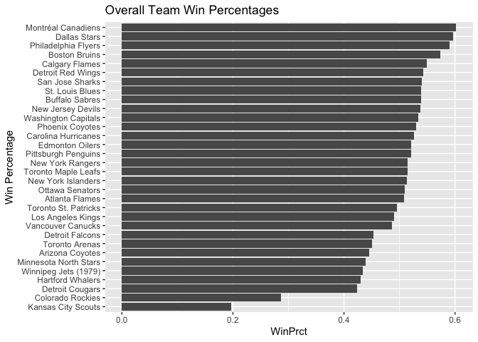
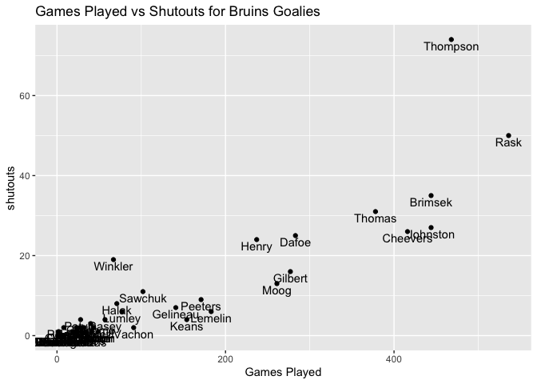
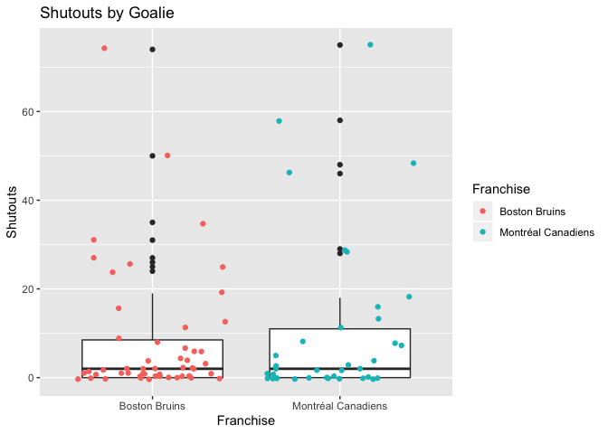

Guide for Using the NHL API
================
Matt Kasle
9/16/2020

## Required Packages

This vignette requires the Tidyverse, httr, and jsonlite packages.

## API Helper Function

The NHL provides APIs to access an array of team and player statistics.
This vignette provides functions to help users access this data and
return well-formatted dataframes for various endpoints. The code below
creates a wrapper function for “one-stop-shop” access to a number of
endpoints in these APIs.

You can query either API using the function `getNHLData()`, which takes
an available NHL API endpoint, and optionally a team and season, and
returns a filtered dataset. You can provide either the team id or the
team name.

The available endpoints that a user can provide are: <br>

Records API:

  - franchises  
  - franchise-team-totals  
  - franchise-season-records  
  - franchise-goalie-records  
  - franchise-skater-records

Stats
API:

  - teams  
  - team.roster  
  - person.names  
  - team.schedule.next  
  - team.schedule.previous  
  - team.stats  
  - statsSingleSeasonPlayoffs

Examples:

``` r
knitr::kable(head(getNHLData("franchises")))
```

| id | firstSeasonId | lastSeasonId | mostRecentTeamId | teamCommonName | teamPlaceName |
| -: | ------------: | -----------: | ---------------: | :------------- | :------------ |
|  1 |      19171918 |           NA |                8 | Canadiens      | Montréal      |
|  2 |      19171918 |     19171918 |               41 | Wanderers      | Montreal      |
|  3 |      19171918 |     19341935 |               45 | Eagles         | St. Louis     |
|  4 |      19191920 |     19241925 |               37 | Tigers         | Hamilton      |
|  5 |      19171918 |           NA |               10 | Maple Leafs    | Toronto       |
|  6 |      19241925 |           NA |                6 | Bruins         | Boston        |

``` r
knitr::kable(head(getNHLData("franchise-team-totals", 6)))
```

| id | activeFranchise | firstSeasonId | franchiseId | gameTypeId | gamesPlayed | goalsAgainst | goalsFor | homeLosses | homeOvertimeLosses | homeTies | homeWins | lastSeasonId | losses | overtimeLosses | penaltyMinutes | pointPctg | points | roadLosses | roadOvertimeLosses | roadTies | roadWins | shootoutLosses | shootoutWins | shutouts | teamId | teamName      | ties | triCode | wins |
| -: | --------------: | ------------: | ----------: | ---------: | ----------: | -----------: | -------: | ---------: | -----------------: | -------: | -------: | :----------- | -----: | -------------: | -------------: | --------: | -----: | ---------: | -----------------: | -------: | -------: | -------------: | -----------: | -------: | -----: | :------------ | ---: | :------ | ---: |
| 11 |               1 |      19241925 |           6 |          2 |        6570 |        19001 |    20944 |        953 |                 89 |      376 |     1867 | NA           |   2387 |            184 |          88037 |    0.5625 |   7391 |       1434 |                 95 |      415 |     1341 |             80 |           64 |      500 |      6 | Boston Bruins |  791 | BOS     | 3208 |
| 12 |               1 |      19241925 |           6 |          3 |         664 |         1875 |     1923 |        149 |                  2 |        3 |      191 | NA           |    332 |              0 |          10505 |    0.0301 |     40 |        183 |                  2 |        3 |      135 |              0 |            0 |       49 |      6 | Boston Bruins |    6 | BOS     |  326 |

``` r
knitr::kable(getNHLData("team.roster", "Bruins"))
```

| jerseyNumber | person.id | person.fullName  | person.link            | position.code | position.name | position.type | position.abbreviation |
| :----------- | --------: | :--------------- | :--------------------- | :------------ | :------------ | :------------ | :-------------------- |
| 86           |   8476191 | Kevan Miller     | /api/v1/people/8476191 | D             | Defenseman    | Defenseman    | D                     |
| 33           |   8465009 | Zdeno Chara      | /api/v1/people/8465009 | D             | Defenseman    | Defenseman    | D                     |
| 37           |   8470638 | Patrice Bergeron | /api/v1/people/8470638 | C             | Center        | Forward       | C                     |
| 41           |   8470860 | Jaroslav Halak   | /api/v1/people/8470860 | G             | Goalie        | Goalie        | G                     |
| 46           |   8471276 | David Krejci     | /api/v1/people/8471276 | C             | Center        | Forward       | C                     |
| 40           |   8471695 | Tuukka Rask      | /api/v1/people/8471695 | G             | Goalie        | Goalie        | G                     |
| 63           |   8473419 | Brad Marchand    | /api/v1/people/8473419 | L             | Left Wing     | Forward       | LW                    |
| 27           |   8475186 | John Moore       | /api/v1/people/8475186 | D             | Defenseman    | Defenseman    | D                     |
| 13           |   8475745 | Charlie Coyle    | /api/v1/people/8475745 | C             | Center        | Forward       | C                     |
| 14           |   8475780 | Chris Wagner     | /api/v1/people/8475780 | R             | Right Wing    | Forward       | RW                    |
| 20           |   8475807 | Joakim Nordstrom | /api/v1/people/8475807 | C             | Center        | Forward       | C                     |
| 52           |   8476374 | Sean Kuraly      | /api/v1/people/8476374 | C             | Center        | Forward       | C                     |
| 35           |   8476509 | Maxime Lagace    | /api/v1/people/8476509 | G             | Goalie        | Goalie        | G                     |
| 47           |   8476792 | Torey Krug       | /api/v1/people/8476792 | D             | Defenseman    | Defenseman    | D                     |
| 48           |   8476891 | Matt Grzelcyk    | /api/v1/people/8476891 | D             | Defenseman    | Defenseman    | D                     |
| 75           |   8477365 | Connor Clifton   | /api/v1/people/8477365 | D             | Defenseman    | Defenseman    | D                     |
| 21           |   8477941 | Nick Ritchie     | /api/v1/people/8477941 | L             | Left Wing     | Forward       | LW                    |
| 88           |   8477956 | David Pastrnak   | /api/v1/people/8477956 | R             | Right Wing    | Forward       | RW                    |
| 10           |   8478075 | Anders Bjork     | /api/v1/people/8478075 | L             | Left Wing     | Forward       | LW                    |
| 28           |   8478131 | Ondrej Kase      | /api/v1/people/8478131 | R             | Right Wing    | Forward       | RW                    |
| 67           |   8478415 | Jakub Zboril     | /api/v1/people/8478415 | D             | Defenseman    | Defenseman    | D                     |
| 80           |   8478435 | Dan Vladar       | /api/v1/people/8478435 | G             | Goalie        | Goalie        | G                     |
| 25           |   8478443 | Brandon Carlo    | /api/v1/people/8478443 | D             | Defenseman    | Defenseman    | D                     |
| 79           |   8478468 | Jeremy Lauzon    | /api/v1/people/8478468 | D             | Defenseman    | Defenseman    | D                     |
| 19           |   8478485 | Zach Senyshyn    | /api/v1/people/8478485 | R             | Right Wing    | Forward       | RW                    |
| 74           |   8478498 | Jake DeBrusk     | /api/v1/people/8478498 | L             | Left Wing     | Forward       | LW                    |
| 73           |   8479325 | Charlie McAvoy   | /api/v1/people/8479325 | D             | Defenseman    | Defenseman    | D                     |
| 82           |   8479365 | Trent Frederic   | /api/v1/people/8479365 | C             | Center        | Forward       | C                     |
| 58           |   8480001 | Urho Vaakanainen | /api/v1/people/8480001 | D             | Defenseman    | Defenseman    | D                     |
| 68           |   8480021 | Jack Studnicka   | /api/v1/people/8480021 | C             | Center        | Forward       | C                     |
| 83           |   8480901 | Karson Kuhlman   | /api/v1/people/8480901 | C             | Center        | Forward       | C                     |
| 26           |   8480944 | Par Lindholm     | /api/v1/people/8480944 | C             | Center        | Forward       | C                     |

# Data Exploration

We’ll explore this data set in a few different ways. Through this
process, I’ll demonstrate how to use this set of functions.

First, we’ll read in franchise team totals, filtered to only regular
season games and active franchises

``` r
# regular season totals for active teams
regularSeasonTotals <- getNHLData("franchise-team-totals") %>% filter(gameTypeId == 2)  %>%  filter(activeFranchise == 1) 
```

Next, we’ll create some new variables. We’ll create win percentage, goal
differential, and home/road win
percentage:

``` r
regularSeasonTotals$WinPrct <- regularSeasonTotals$wins / (regularSeasonTotals$wins + regularSeasonTotals$losses)

regularSeasonTotals$goaldiff <- regularSeasonTotals$goalsFor - regularSeasonTotals$goalsAgainst

regularSeasonTotals$homeWinPrct <- regularSeasonTotals$homeWins / (regularSeasonTotals$homeWins + regularSeasonTotals$homeLosses)

regularSeasonTotals$roadWinPrct <- regularSeasonTotals$roadWins / (regularSeasonTotals$roadWins + regularSeasonTotals$roadLosses)
```

Next, we’ll get team data from the Stats API, which has more details
about each franchise like division, conference, and time zone, and join
that to the previous data set.

``` r
# only for active teams
activeTeams <- getNHLData("teams")

# gets division name, venue, other interesting information
activeTeamStats <- dplyr::inner_join(regularSeasonTotals, activeTeams, by = c("franchiseId" = "id")) 
```

Now, we can plot the all-time win percentage for each team in the
league:

``` r
g <- ggplot(data = activeTeamStats, aes(reorder(teamName.x, WinPrct), WinPrct))
g + geom_bar(stat="Identity") + 
  labs(x = "") +
  coord_flip() + 
  labs(x = "Win Percentage") +
  ggtitle("Overall Team Win Percentages")
```

<!-- -->

We can also see where teams are located geographically. 12 of the 14
Eastern Conference teams are on the East Coast. By comparison, Western
Conference teams are spread out geographically, with teams in central,
mountain, pacific, and vancouver time
zones.

``` r
knitr::kable(table(activeTeamStats$venue.timeZone.id, activeTeamStats$conference.name),
             caption="Team Time Zones by Conference")
```

|                      | Eastern | Western |
| -------------------- | ------: | ------: |
| America/Chicago      |       0 |       5 |
| America/Denver       |       0 |       3 |
| America/Detroit      |       1 |       0 |
| America/Edmonton     |       0 |       1 |
| America/Los\_Angeles |       0 |       6 |
| America/New\_York    |      12 |       0 |
| America/Toronto      |       1 |       0 |
| America/Vancouver    |       0 |       3 |

Team Time Zones by Conference

There are four divisions. The Metropolitan division has team closest
together by time zone, as all ten teams are on the east
coast.

``` r
knitr::kable(table(activeTeamStats$venue.timeZone.id, activeTeamStats$division.name),
             caption="Team Time Zones by Conference")
```

|                      | Atlantic | Central | Metropolitan | Pacific |
| -------------------- | -------: | ------: | -----------: | ------: |
| America/Chicago      |        0 |       5 |            0 |       0 |
| America/Denver       |        0 |       2 |            0 |       1 |
| America/Detroit      |        1 |       0 |            0 |       0 |
| America/Edmonton     |        0 |       0 |            0 |       1 |
| America/Los\_Angeles |        0 |       0 |            0 |       6 |
| America/New\_York    |        2 |       0 |           10 |       0 |
| America/Toronto      |        1 |       0 |            0 |       0 |
| America/Vancouver    |        0 |       0 |            0 |       3 |

Team Time Zones by Conference

Now, let’s view all-time win percentages of teams by
division:

``` r
g <- ggplot(data = activeTeamStats, aes(reorder(teamName.x, WinPrct), WinPrct))
g + geom_bar(stat="Identity", aes(fill=division.name)) + 
  labs(x = "") +
  coord_flip() + 
  labs(x = "Win Percentage", fill="Division") +
  ggtitle("Overall Team Win Percentages, including division")
```

<!-- -->

Now let’s explore the team history of a single team. Being from Boston,
I will choose my hometown Bruins. We see below that Rask played the most
games as the Bruins goalie, but Thompson had by far the most shutouts
despite playing about 50 fewer games.

``` r
bruinsGoalies <- getNHLData("franchise-goalie-records", team = "Bruins")


g <- ggplot(bruinsGoalies, aes(x = gamesPlayed, y = shutouts))
g + geom_point() +
    labs(x = "Games Played", fill="Shutouts") +
    geom_text(aes(label=lastName),hjust=0.5, vjust=1.2) +
    ggtitle("Games Played vs Shutouts for Bruins Goalies")
```

<!-- -->

There aren’t many major outliers for wins compared to total games played
for Bruins goalies, though Johnston seems to have a much lower win
percentage than other goalies. Thompson does not seem to have a much
higher win percentage than other goalies, despite the fact that he had
the most shutouts.

``` r
g <- ggplot(bruinsGoalies, aes(x = gamesPlayed, y = wins))
g + geom_point() +
    geom_text(aes(label=lastName),hjust=0.5, vjust=1.2) +
    labs(x = "Games Played", y="Wins") +
    ggtitle("Games Played vs Wins for Bruins Goalies")
```

<!-- -->

Let’s compare historical goalie performance between the Bruins and their
rivals, the
Canadiens.

``` r
canadiansGoalies <- getNHLData("franchise-goalie-records", team = "Canadiens")
canadianAndBruinGoalies <- dplyr::bind_rows(bruinsGoalies, canadiansGoalies)

g <- ggplot(canadianAndBruinGoalies, aes(x = franchiseName, y = shutouts))
g + geom_boxplot() +
    geom_jitter(mapping = aes(color = franchiseName)) + 
    labs(x = "Franchise", color = "Franchise", y = "Shutouts") +
    ggtitle("Shutouts by Goalie")
```

<!-- -->

Here is a look at the distribution of the chart above. They look fairly
similar.

``` r
g <- ggplot(canadianAndBruinGoalies, aes(x = shutouts))
g + geom_histogram(aes(y = ..density..), bins=20) +
    facet_wrap(~ franchiseName) +
    labs(x = "Shutouts", y = "Density") +
    ggtitle("Distribution of Career Shutouts by Franchise Goalies, Bruins vs Canadians")
```

<!-- -->

Now, we’ll compare the same distribution with a much newer franchise,
the Tampa Bay Lightning. We see that the Lightning have no goalies with
more than 25 career shutouts, while the Bruins have multiple goalies
with that
distinction.

``` r
lightningGoalies <- getNHLData("franchise-goalie-records", team = "Lightning")
lightningAndBruinGoalies <- dplyr::bind_rows(bruinsGoalies, lightningGoalies)

g <- ggplot(lightningAndBruinGoalies, aes(x = shutouts))
g + geom_histogram(aes(y = ..density..), bins=20) +
    facet_wrap(~ franchiseName) +
    labs(x = "Shutouts", y = "Density") +
    ggtitle("Distribution of Career Shutouts by Franchise Goalies, Bruins vs Canadians")
```

<!-- -->

We can also look at the performance of teams by their goal differential
(how many more or less goals they’ve scored compared to their opponent).

We look at that by
division:

``` r
knitr::kable(activeTeamStats %>% group_by(division.name) %>% summarise("Avg. Goal Differetial Per Season" = mean(goaldiff,na.rm=TRUE)))
```

| division.name | Avg. Goal Differetial Per Season |
| :------------ | -------------------------------: |
| Atlantic      |                         262.0000 |
| Central       |                         354.4286 |
| Metropolitan  |                         377.2000 |
| Pacific       |                       \-328.5455 |

We can see by team the most goals that they have allowed.

``` r
allGoalies <- getNHLData("franchise-goalie-records")
knitr::kable(allGoalies %>% group_by(franchiseName) %>% summarise("Most Goals Allowed in a Game" = max(mostGoalsAgainstOneGame)))
```

| franchiseName         | Most Goals Allowed in a Game |
| :-------------------- | ---------------------------: |
| Anaheim Ducks         |                            8 |
| Arizona Coyotes       |                           15 |
| Boston Bruins         |                           13 |
| Brooklyn Americans    |                           10 |
| Buffalo Sabres        |                           11 |
| Calgary Flames        |                           11 |
| Carolina Hurricanes   |                           11 |
| Chicago Blackhawks    |                           12 |
| Cleveland Barons      |                           11 |
| Colorado Avalanche    |                           12 |
| Columbus Blue Jackets |                            8 |
| Dallas Stars          |                           10 |
| Detroit Red Wings     |                           11 |
| Edmonton Oilers       |                            9 |
| Florida Panthers      |                            8 |
| Hamilton Tigers       |                           16 |
| Los Angeles Kings     |                           11 |
| Minnesota Wild        |                            8 |
| Montréal Canadiens    |                           11 |
| Montreal Maroons      |                            8 |
| Montreal Wanderers    |                           11 |
| Nashville Predators   |                            8 |
| New Jersey Devils     |                           10 |
| New York Islanders    |                           11 |
| New York Rangers      |                           15 |
| Ottawa Senators       |                           11 |
| Philadelphia Flyers   |                           11 |
| Philadelphia Quakers  |                           10 |
| Pittsburgh Penguins   |                           13 |
| San Jose Sharks       |                           11 |
| St. Louis Blues       |                           10 |
| St. Louis Eagles      |                           11 |
| Tampa Bay Lightning   |                           10 |
| Toronto Maple Leafs   |                           13 |
| Vancouver Canucks     |                           13 |
| Vegas Golden Knights  |                            7 |
| Washington Capitals   |                           11 |
| Winnipeg Jets         |                            9 |

Finally, we’ll summerize home and road
performance

``` r
# function creates a summary table subsetted on an iris specialties provided by the user
createSummaryTable <- function(division, columns){
  
  # filter dataset by species
  activeTeamsSubset <- activeTeamStats %>% filter(division.name == division) %>% select(columns)
  
  # create summary table
  division_summary <- rbind(apply(activeTeamsSubset,2, min, na.rm=TRUE), 
           apply(activeTeamsSubset,2, quantile, probs=c(.25), na.rm=TRUE),
           apply(activeTeamsSubset,2, median, na.rm=TRUE),
           apply(activeTeamsSubset,2, mean, na.rm=TRUE),
           apply(activeTeamsSubset,2, quantile, probs=c(.75), na.rm=TRUE),
           apply(activeTeamsSubset,2, max, na.rm=TRUE))
  
  division_summary <- round(division_summary, 1)
  # rename index
  rownames(division_summary) <- c("Min.",
                 "1st Qu.",
                 "Median",
                 "Mean",
                 "3rd Qu.",
                 "Max.")
  
  division_summary <- knitr::kable(division_summary, caption = paste("Summary of Division Road Records: ", division))
  return(division_summary)
}

createSummaryTable("Atlantic", c("roadWins", "roadLosses", "roadOvertimeLosses"))
```

|         | roadWins | roadLosses | roadOvertimeLosses |
| ------- | -------: | ---------: | -----------------: |
| Min.    |    715.0 |     1039.0 |               74.0 |
| 1st Qu. |    741.2 |     1039.0 |               86.0 |
| Median  |   1003.0 |     1236.5 |               91.0 |
| Mean    |   1015.5 |     1268.2 |               87.8 |
| 3rd Qu. |   1277.2 |     1465.8 |               92.8 |
| Max.    |   1341.0 |     1561.0 |               95.0 |

Summary of Division Road Records:
Atlantic

``` r
createSummaryTable("Pacific", c("roadWins", "roadLosses", "roadOvertimeLosses"))
```

|         | roadWins | roadLosses | roadOvertimeLosses |
| ------- | -------: | ---------: | -----------------: |
| Min.    |      7.0 |       66.0 |               28.0 |
| 1st Qu. |    142.5 |      231.5 |               65.5 |
| Median  |    275.0 |      393.0 |               78.0 |
| Mean    |    354.5 |      477.4 |               69.9 |
| 3rd Qu. |    644.0 |      757.0 |               79.0 |
| Max.    |    722.0 |      993.0 |               94.0 |

Summary of Division Road Records:
Pacific

``` r
createSummaryTable("Metropolitan", c("roadWins", "roadLosses", "roadOvertimeLosses"))
```

|         | roadWins | roadLosses | roadOvertimeLosses |
| ------- | -------: | ---------: | -----------------: |
| Min.    |      3.0 |       17.0 |               73.0 |
| 1st Qu. |     30.8 |       52.2 |               75.0 |
| Median  |    376.0 |      455.0 |               76.0 |
| Mean    |    503.0 |      616.4 |               77.6 |
| 3rd Qu. |    977.2 |     1203.0 |               79.0 |
| Max.    |   1424.0 |     1607.0 |               85.0 |

Summary of Division Road Records: Metropolitan
